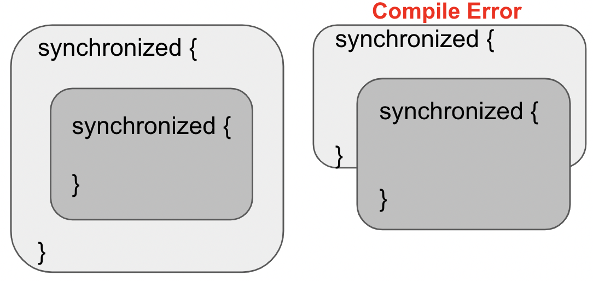
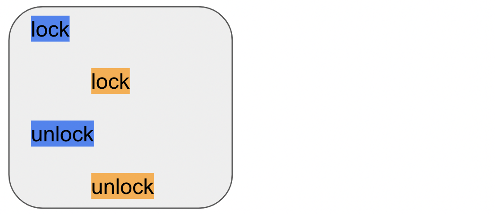
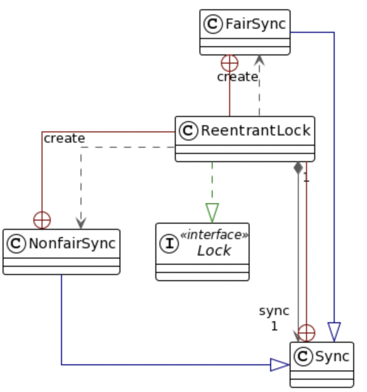

# ReentrantLock

## 1. 개요

- Lock 구현은 synchronized 구문과 마찬가지로 **상호배제와 가시성 기능을 가진 동기화 기법**이며 보다 더 확장된 락을 제공한다
- Lock 구현은 락을 획득 시 블록되지 않는 비 차단 시도(tryLock()), 인터럽트가 가능한 방식으로 락을 획득하는 시도(lockInterruptibly) 및 시간 제한을 둔 방식으로 락을 획득하는 시도(tryLock(long, TimeUnit))와 같은 추가 기능을 제공한다.

- synchronized 는 블록을 벗어나면 락 해제가 자동적으로 이루어지지만 Lock 구현은 명시적으로 락을 해제해 주어야 한다

- synchronized는 락 획득과 락 해제가 **블록 구조화**된 방식으로 발생하도록 강제한다
  - 여러 락을 획득하면 반드시 반대 순서로 해제해야 하며 모든 락은 동일한 문장 블록 범위에서 획득하고 해제되어야 한다

- Lock 구현은 락을 더 유연한 방식으로 작업할 수 있도록 지원한다
  - 락을 다른 범위에서 획득하고 해제하도록 허용하며 락을 어떤 순서로든 획득하고 해제할 수 있다.

## 2. Diagram

## 3. ReentrantLock API

#### void lock()

~~~
락이 다른 스레드에 의해 보유되고 있지 않다면 락을 즉시 획득하고 락의 보유 횟수를 1로 설정한다
현재 스레드가 이미 이 락을 보유하고 있다면 보유 횟수가 1 증가하고 메서드는 즉시 반환된다(락의 재진입 가능)
락이 다른 스레드에 의해 보유되어 있다면 현재 스레는 락이 획득될 때까지 대기하며 이후에 락을 성공적으로 획득하면 보유 횟수가 1로 설정된다
~~~

#### void lockInterruptibly() throws InterruptedException

~~~
현재 스레드가 인터럽트 되지 않는 한 락을 획득하며 다른 스레드에 의해 보유되지 않는다면 락을 즉시 획득하고 락의 보유 횟수를 1로 설정한다
현재 스레드가 이미 이 락을 보유하고 있다면 보유 횟수가 1 증가하고 메서드는 즉시 반환된다
락이 다른 스레드에 의해 보유되어 있다면 락이 현재 스레드에 의해 획득될 때까지 대기한다. 
현재 스레드가 이 메서드에 진입할 때 인터럽트 상태가 설정되어 있는 경우나 또는 락을 획득하는 도중에 인터럽트가 발생한 경우 InterruptedException이 발생하며 인터럽트 상태는 초기화 된다 
락을 정상적으로 또는 재진입으로 획득하는 것보다 인터럽트에 응답하는 것이 우선적으로 처리된다
~~~

#### boolean tryLock()

~~~
이 락이 호출 시점에 다른 스레드에 의해 보유되지 않을 때만 락을 획득하고 락의 보유 횟수를 1로 설정하고  true 를 반환한다
이 락이 공정성을 가지도록 설정되었더라도 현재 다른 스레드가 락을 기다리는지 여부와 관계없이 락이 사용 가능한 경우 즉시 락을 획득한다
현재 스레드가 이미 이 락을 보유하고 있다면, 보유 횟수가 1 증가하고 true 를 반환한다
락이 다른 스레드에 의해 소유되어 있다면 이 메서드는 즉시 false 값을 반환한다.(락획득 실패 시 스레드가 대기하거나 차단되지 않는다)
~~~

#### boolean tryLock(long time, TimeUnit unit) throws InterruptedException

~~~
주어진 대기 시간 내에 다른 스레드에 의해 보유되지 않으면 락을 획득하고 락의 보유 횟수를 1로 설정하고 true 를 반환한다.
이 락이 공정성을 가지도록 설정 되었다면 락이 사용 가능한 경우에는 다른 스레드가 락을 기다리고 있는지 여부와 상관없이 즉시 락을 획득하지 않는다.
현재 스레드가 이미 이 락을 보유하고 있다면 보유 횟수가 1 증가하고, 락이 다른 스레드에 의해 보유되어 있다면 락이 획득될 때까지 대기한다
현재 스레드가 이 메서드를 호출할 때 인터럽트 상태가 설정되어 있거나 락을 획득하는 동안 인터럽트가 발생한 경우 InterruptedException 이 발생 되고 인터럽트 상태가 초기화된다 
지정된 대기 시간이 경과하면 값 false 가 반환되며 만약 시간이 0보다 작거나 같으면 메서드는 전혀 대기하지 않는다
락의 정상적인 또는 재진입 획득 및 대기 시간 경과 보다 인터럽트에 응답하는 것이 우선적으로 처리된다
~~~

#### void unlock()

~~~
이 락을 해제하려고 시도한다. 
락을 해제하려면 동일한 스레드에서 lock() 메서드가 호출된 횟수와 동일한 횟수로 호출해야 한다. (락 카운트가 0 이면 락이 해제)
현재 스레드가 이 락의 소유자가 아닌 경우 IllegalMonitorStateException 이 발생한다
~~~

#### Condition newCondition()

~~~
이 Lock 인스턴스와 함께 사용하기 위한 Condition 인스턴스를 반환한다
Condition 인스턴스는 Object 모니터 메서드와 동일한 용도를 지원하며 대기 또는 신호 메서드가 호출될 때 락이 없을 경우 IllegalMonitorStateException 이 발생한다
대기 메서드가 호출되면 락이 해제되고 신호 메서드가 호출되어 대기 메서드에서 반환하기 전에 스레드는 락을 다시 획득한다
스레드가 대기하는 동안 인터럽트가 발생하면 대기가 종료되고 InterruptedException 이 발생하며 스레드의 인터럽트 상태가 초기화된다
대기 중인 스레드는 FIFO 순서로 신호를 받는다. (먼저 대기한 스레드 순서)
신호에 의해 대기 메서드에서 깨어난 스레드의 락 재획득 순서는 기본적으로 초기에 락을 획득하는 방식과 동일하나 공정 락의 경우 가장 오래 기다리는 스레드에 우선권이 주어진다
~~~

**ReentrantLock()** // ReentrantLock(false)를 사용하는 것과 동일하며 내부적으로 NonfairSync 클래스 객체인 불공정성 락을 생성한다

**ReentrantLock(boolean fair)** //주어진 공정성 정책으로 인스턴스를 생성한다. 공정성 락을 사용해야 하는 경우 fair 는 true 이며 내부적으로 FairSync 클래스 객체를 생성한다

#### int getHoldCount()

~~~
현재 스레드가 이 락을 보유한 횟수
~~~

#### boolean isHeldByCurrentThread()

~~~
현재 스레드가 이 락을 보유하고 있는지 확인 (주로 디버깅 및 테스트에 사용)
~~~

#### boolean hasQueuedThreads()

~~~
스레드가 이 락을 획득하기 위해 대기 중인지 여부.
취소는 언제든지 발생할 수 있으므로 true 를 반환한다고 해서 다른 스레드가 이 락을 획득한다고 보장하지 않는다 (모니터링 용으로 사용)
~~~

#### int getQueueLength()

~~~
이 락을 획득하기 위해 대기 중인 스레드 수의 추정치.
이 값은 내부 데이터 구조를 탐색하는 동안 스레드 수가 동적으로 변경될 수 있기 때문에 실제값과 다를 수 있다 (모니터링 용으로 사용)
~~~

#### boolean hasWaiters(Condition condition)

~~~
해당 락과 관련된 지정된 Condition 에 대기 중인 스레드가 있는지를 조회한다 
타임아웃과 인터럽트가 언제든 발생할 수 있기 때문에 true 가 반환된다고 해서 미래의 신호가 어떤 스레드를 깨우게 할 것임을 보장하지는 않는다 (모니터링 용으로 사용)
~~~

#### int getWaitQueueLength(Condition condition)

~~~
이 락과 관련된 지정된 Condition 에 대기 중인 스레드의 수에 대한 추정치.
타임아웃과 인터럽트가 언제든 발생할 수 있기 때문에 이 추정치는 실제 대기 중인 스레드 수에 대한 상한선 역할을 한다(모니터링 용으로 사용)
~~~

#### Collection<Thread> getWaitingThreads(Condition condition)

~~~
이 락과 관련된 지정된 Condition 에 대기 중인 스레드를 포함하는 컬렉션을 반환한다
실제 스레드 집합이 이 결과를 구성하는 동안 동적으로 변경될 수 있으므로 반환된 컬렉션은 최선의 추정치에 불과하며 반환된 컬렉션의 요소는 특정한 순서로 나열되지 않는다(모니터링 용으로 사용)
~~~

## 4. Synchronization vs Lock

### ReentrantLock

- 비 차단 락 획득이 필요한 경우
- 락 획득을 시도하거나 대기하는 중에 중단이 필요한 경우 (InterruptExecption)
- 지정된 시간 안에 락 획득이 필요한 경우
- 공정하게 락을 획득하는 정책을 사용하는 경우 
- 락의 획득과 해제가 단일 블록을 벗어는 경우

### synchronized

- ReentrantLock 의 기능이 필요하지 않을 경우
- 사용하기 더 편리하고 익숙하다
- 성능상 크게 차이가 나지 않으며 락 해제가 불 필요 하다
- 복잡하지 않고 문법적으로 더 간단하며 단순한 동기화에서는 가독성이 좋을 수 있다 

## 5. 예제

~~~
reentrant/basic/
_01_ ~ _03_ 코드참조
reentrant/api/
_04_ ~ _07_ 코드 참조
~~~

