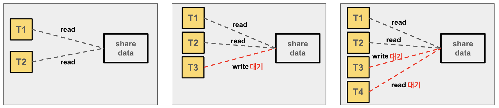
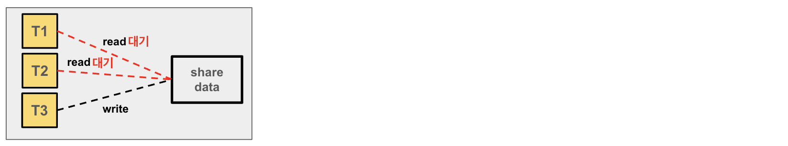
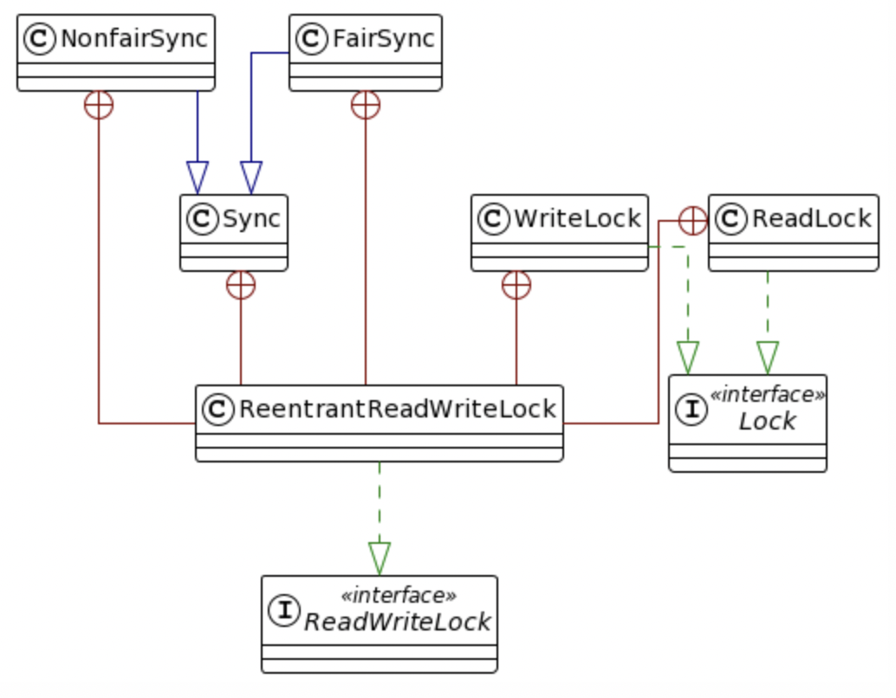
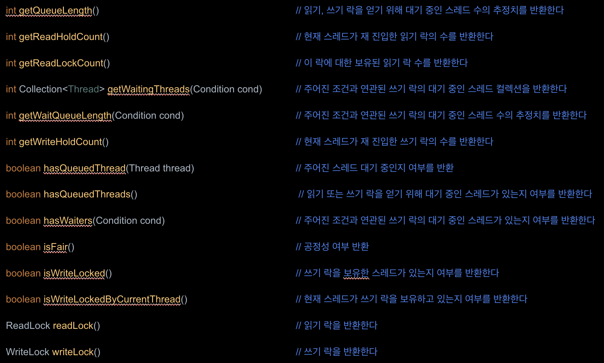

# ReentrantReadWriteLock

## 1. 개요

- ReadWriteLock 은 읽기 작업과 쓰기 작업을 위해 연관된 두 개의 락(읽기 락, 쓰기 락)을 유지하는 인터페이스이다
- 일반적으로 락은 데이터를 조작하는 하나의 스레드의 임계영역을 보호하는 장치이며 데이터를 읽는 작업만 실행되는 영역은 여러 스레드가 동시에 접근해도 동시성 문제가 발생하지 않는다 
- 읽기 작업이 많고 쓰기 작업이 적은 영역을 효율적으로 처리하기 위해 **다수의 읽기와 하나의 쓰기를 읽기락과 쓰기락으로 구분해서 락을 운용**하는 것이 필요하다 

## 2. 특징

### 성능

- 읽기 락과 쓰기 락의 조합은 상호 배타적인 락을 사용하는 것보다 데이터에 대한 동시 액세스를 허용하므로 동시성이 높아진다
- 특히 읽기 작업이 더 빈번한 경우에 효과적이며 읽기 락의 경우 여러 스레드가 동시에 데이터를 읽을 수 있고 쓰기 락의 경우 하나의 스레드만 데이터를 수정할 수 있다

### 메모리 동기화

- 읽기 락 작업은 다른 읽기 락 작업과 상호 작용하는 것이 아니므로 스레드 간 동시에 읽기 작업을 하더라도 메모리의 가시성이 있다.
- 쓰기 락 작업은 읽기 작업 및 다른 쓰기 작업과의 메모리 동기화를 보장해야 한다. 즉 스레드가 쓰기 락을 해제하고 다른 스레드가 읽기 락을 얻었을 때 이전 쓰기 작업의 업데이트를 볼 수 있어야 한다.

### 사용 처

- 읽기/쓰기 락의 사용은 데이터가 읽히는 빈도와 수정되는 빈도, 읽기 및 쓰기 작업의 지속 시간, 데이터에 대한 경합(동시에 데이터를 읽거나 쓰려는 스레드 수)에 따라 결정된다
- 수정은 드물게 일어나고 검색은 빈번히 발생한다면 읽기/쓰기 락의 사용에 적합한 이상적인 후보라 할 수 있지만 업데이트가 빈번해지면 데이터가 대부분 배타적으로 작동한다.
- 읽기 작업 시간이 긴 경우 여러 스레드들이 경합없이 모두 읽는 이점이 있으나 너무 짧은 경우 읽기/쓰기 락 구현의 오버헤드(읽기작업과 쓰기 작업의 상태를 계속 확인하기 때문에 상호 배제 락보다 알고리즘이 더 복잡함)가 증가하기 때문에 효율성이 떨어진다 

#### ReentrantReadWriteLock.ReadLock

- 여러 읽기 스레드가 동시에 읽기 락을 얻을 수 있으며 읽기 락이 보유되는 동안에는 **다른 읽기 스레드들도 읽기 락을 얻을 수 있다**
- **쓰기 락은 읽기 락이 보유되는 동안에 얻을 수 없다**. 그러나 대기하는 중에도 계속 읽기락을 요청하는 상황이 발생하면 쓰기락을 요청한 스레드는 기아상태가 될 수 있으므로 **쓰기락을 요청한 상태에서는 더 이상 스레드가 읽기 접근을 할 수 없다**.
- 가장 큰 장점은 여러 스레드가 상호배제 없이 동시에 데이터를 읽을 수 있어서 동시성이 증가한다는 점이다.

#### ReentrantReadWriteLock.WriteLock

- 쓰기 락은 배타적이며 한 번에 하나의 스레드만 쓰기 락을 보유할 수 있고 쓰기 **락을 보유하는 동안에는 다른 어떤 스레드도 읽기 락이나 쓰기 락을 얻을 수 없다.** 

## 3. Diagram

## 4. API

### ReentrantReadWriteLock API

### ReentrantReadWriteLock.ReadLock API

#### void lock()

~~~
쓰기 락이 다른 스레드에 의해 보유되지 않는 한 즉시 락을 획득하고 락의 보유 횟수를 1로 설정한다
현재 스레드가 이미 이 락을 보유하고 있다면 보유 횟수가 1 증가하고 메서드는 즉시 반환된다(락 재진입 가능)
락이 획득될 때까지 대기하며 이후에 락을 성공적으로 획득하면 보유 횟수가 1로 설정된다
~~~

#### void lockInterruptibly() throws InterruptedException

~~~
현재 스레드가 인터럽트 되지 않는 한 락을 획득하며 쓰기 락이 다른 스레드에 의해 보유되지 않는다면 락을 즉시 획득하고 락의 보유 횟수를 1로 설정한다
현재 스레드가 이미 이 락을 보유하고 있다면 보유 횟수가 1 증가하고 메서드는 즉시 반환된다
락이 다른 스레드에 의해 보유되어 있다면 락이 현재 스레드에 의해 획득될 때까지 대기한다. 
현재 스레드가 이 메서드에 진입할 때 인터럽트 상태가 설정되어 있는 경우나 또는 락을 획득하는 도중에 인터럽트가 발생한 경우 InterruptedException이 발생하며 인터럽트 상태는 초기화 된다 
락을 정상적으로 또는 재진입으로 획득하는 것보다 인터럽트에 응답하는 것이 우선적으로 처리된다
~~~

#### boolean tryLock()

~~~
이 락이 호출 시점에 다른 스레드에 의해 쓰기 락이 보유되지 않을 때만 락을 획득하고 락의 보유 횟수를 1로 설정하고  true 를 반환한다
이 락이 공정성을 가지도록 설정되었더라도 현재 다른 스레드가 락을 기다리는지 여부와 관계없이 락이 사용 가능한 경우 즉시 락을 획득한다
현재 스레드가 이미 이 락을 보유하고 있다면, 보유 횟수가 1 증가하고 true 를 반환한다
락을 획득하지 못하더라도 스레드가 대기하거나 차단되지 않는다 (false 반환)
~~~

#### boolean tryLock(long time, TimeUnit unit) throws InterruptedException

~~~
주어진 대기 시간 내에 다른 스레드에 의해 쓰기 락이 보유되지 않으면 락을 획득하고 락의 보유 횟수를 1로 설정하고 true 를 반환한다 
이 락이 공정성을 가지도록 설정 되었다면 락이 사용 가능한 경우에는 다른 스레드가 락을 기다리고 있는지 여부와 상관없이 즉시 락을 획득하지 않는다. 이는 tryLock() 메서드와는 대조적이라 할 수 있다 
현재 스레드가 이미 이 락을 보유하고 있다면 보유 횟수가 1 증가하고 메서드는 true 를 반환하고 쓰기 락이 다른 스레드에 의해 보유되어 있다면 락이 획득될 때까지 대기한다
현재 스레드가 이 메서드를 호출할 때 인터럽트 상태가 설정되어 있거나 락을 획득하는 동안 인터럽트가 발생한 경우 InterruptedException 이 발생 되고 인터럽트 상태가 초기화된다 
지정된 대기 시간이 경과하면 값 false 가 반환되며 만약 시간이 0보다 작거나 같으면 메서드는 전혀 대기하지 않는다
락의 정상적인 또는 재진입 획득 및 대기 시간 경과 보다 인터럽트에 응답하는 것이 우선적으로 처리된다
~~~

#### void unlock()

~~~
이 락을 해제하려고 시도한다. 
unlock() 메드가 호출될 때 마다 락 카운트가 감소되며 만약 현재 읽기 락의 수가 0이라면 이 락은 쓰기 락 시도를 위해 사용 가능하게 된다
현재 스레드가 이 락의 소유자가 아닌 경우 IllegalMonitorStateException 이 발생한다
~~~

#### Condition newCondition()

~~~
ReadLock 은 Condition 을 지원하지 않기 때문에 UnsupportedOperationException 이 발생한다
~~~

### ReentrantReadWriteLock.WriteLock API

#### void lock()

~~~
읽기 락이나 쓰기 락이 다른 스레드에 의해 보유되지 않는 한 즉시 락을 획득하고 락의 보유 횟수를 1로 설정한다
현재 스레드가 이미 이 락을 보유하고 있다면 보유 횟수가 1 증가하고 메서드는 즉시 반환된다(락 재진입 가능)
락이 다른 스레드에 의해 보유되어 있다면 현재 스레는 락이 획득될 때까지 대기하며 이후에 락을 성공적으로 획득하면 보유 횟수가 1로 설정된다
~~~

#### void lockInterruptibly() throws InterruptedException

~~~
현재 스레드가 인터럽트 되지 않는 한 락을 획득하며 읽기 락이나 쓰기 락이 다른 스레드에 의해 보유되지 않는다면 락을 즉시 획득하고 락의 보유 횟수를 1로 설정한다
현재 스레드가 이미 이 락을 보유하고 있다면 보유 횟수가 1 증가하고 메서드는 즉시 반환된다
락이 다른 스레드에 의해 보유되어 있다면 락이 현재 스레드에 의해 획득될 때까지 대기한다. 
현재 스레드가 이 메서드에 진입할 때 인터럽트 상태가 설정되어 있는 경우나 또는 락을 획득하는 도중에 인터럽트가 발생한 경우 InterruptedException이 발생하며 인터럽트 상태는 초기화 된다 
락을 정상적으로 또는 재진입으로 획득하는 것보다 인터럽트에 응답하는 것이 우선적으로 처리된다
~~~

#### boolean tryLock()

~~~
이 락이 호출 시점에 다른 스레드에 의해 읽기 락이나 쓰기 락이 보유되지 않을 때만 락을 획득하고 락의 보유 횟수를 1로 설정하고  true 를 반환한다
이 락이 공정성을 가지도록 설정되었더라도 현재 다른 스레드가 락을 기다리는지 여부와 관계없이 락이 사용 가능한 경우 즉시 락을 획득한다
현재 스레드가 이미 이 락을 보유하고 있다면, 보유 횟수가 1 증가하고 true 를 반환한다
락이 다른 스레드에 의해 소유되어 있다면 이 메서드는 즉시 false 값을 반환한다. 그리고 이 메서드는 락을 획득하지 못하더라도 스레드가 대기하거나 차단되지 않는다
~~~

#### boolean tryLock(long time, TimeUnit unit) throws InterruptedException

~~~
주어진 대기 시간 내에 다른 스레드에 의해 읽기 락이나 쓰기 락이 보유되지 않으면 락을 획득하고 락의 보유 횟수를 1로 설정하고 true 를 반환한다 
이 락이 공정성을 가지도록 설정 되었다면 락이 사용 가능한 경우에는 다른 스레드가 락을 기다리고 있는지 여부와 상관없이 즉시 락을 획득하지 않는다. 이는 tryLock() 메서드와는 대조적이라 할 수 있다 
현재 스레드가 이미 이 락을 보유하고 있다면 보유 횟수가 1 증가하고 메서드는 true 를 반환하고 락이 다른 스레드에 의해 보유되어 있다면 락이 획득될 때까지 대기한다
현재 스레드가 이 메서드를 호출할 때 인터럽트 상태가 설정되어 있거나 락을 획득하는 동안 인터럽트가 발생한 경우 InterruptedException 이 발생 되고 인터럽트 상태가 초기화된다 
지정된 대기 시간이 경과하면 값 false 가 반환되며 만약 시간이 0보다 작거나 같으면 메서드는 전혀 대기하지 않는다
락의 정상적인 또는 재진입 획득 및 대기 시간 경과 보다 인터럽트에 응답하는 것이 우선적으로 처리된다
~~~

#### void unlock()

~~~
이 락을 해제하려고 시도한다. 
락을 해제하려면 동일한 스레드에서 lock() 메서드가 호출된 횟수와 동일한 횟수로 호출해야 한다. 즉 unlock() 메드가 호출될 때 마다 락 카운트가 감소되며 락 카운트가 0 이면 락이 해제된다
현재 스레드가 이 락의 소유자가 아닌 경우 IllegalMonitorStateException 이 발생한다
~~~

#### Condition newCondition()

~~~
이 Lock 인스턴스와 함께 사용하기 위한 Condition 인스턴스를 반환한다
Condition 인스턴스는 Object 모니터와 동일한 용도를 지원하며 대기 또는 신호 메서드가 호출될 때 쓰기 락이 없을 경우 IllegalMonitorStateException 이 발생한다

읽기 락은 쓰기 락과 독립적으로 소유되므로 영향을 주지 않지만 현재 스레드가 읽기 락도 획득한 상태에서 조건 대기 메서드를 호출하는 것은 사실상 항상 오류이다. 왜냐하면 대기를 해제할 수 있는 다른 스레드도 쓰기 락을 획득하지 못할 수 있기 때문이다

대기 메서드가 호출되면 락이 해제되고 신호 메서드가 호출되어 대기 메서드에서 반환하기 전에 스레드는 락을 다시 획득한다
스레드가 대기하는 동안 인터럽트가 발생하면 대기가 종료되고 InterruptedException 이 발생하며 스레드의 인터럽트 상태가 초기화된다
대기 중인 스레드는 FIFO 순서로 신호를 받습니다. 즉 먼저 대기한 스레드 순서로 신호를 받게 된다 
신호에 의해 대기 메서드에서 반환되는 스레드의 락 재획득 순서는 기본적으로 초기에 락을 획득하는 스레드와 동일하나공정 락의 경우 가장 오래 기다리는 스레드에 우선권이 주어진다
~~~

## 5. ReentrantReadWriteLock 재 진입성

- 이 락은 ReentrantLock 과 같이 읽기 및 쓰기 락을 다시 획득할 수 있도록 재 진입을 허용하며 쓰기 락을 보유하고 있는 스레드가 모든 쓰기 락을 해제하기 전까지는 재진입이 아닌 (Non-reentrant) 읽기 스레드를 허용하지 않는다
- 쓰기 스레드는 읽기 락을 획득할 수 있지만 읽기 스레드가 쓰기 락을 획득하려고 하면 실패하게 된다
- 쓰기 락을 보유한 스레드가 읽기 락 아래에서 읽기를 수행하는 메서드 또는 콜백 호출 시 재 진입이 유용할 수 있다.

- **락 다운그레이드** (Lock Downgrade)
  - 재 진입성은 쓰기 락에서 읽기 락으로 다운그레이드할 수 있게 해 준다
  - 이를 위해 쓰기 락을 획득하고 그런 다음 읽기 락을 획득하고 마지막으로 쓰기 락을 해제한다

- **락 업그레이드** (Lock Upgrade)
  - 읽기 락에서 쓰기 락으로 업그레이드하는 것은 불가능하다
  - 읽기 락은 여러 스레드가 동시에 보유할 수 있기 때문에 업그레이드가 허용되지 않는다

## 예제

~~~
reentrant/api/
_08_ ~ _011_, _13_ ~ _14_ 코드 참조
~~~

