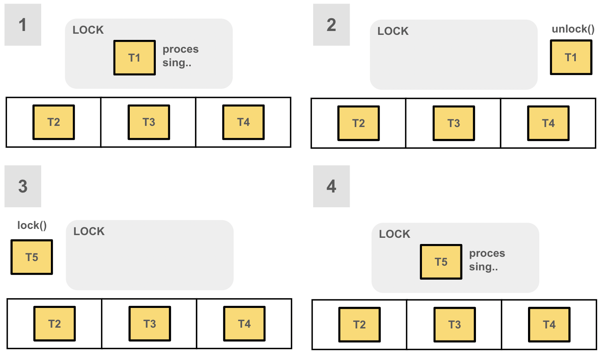
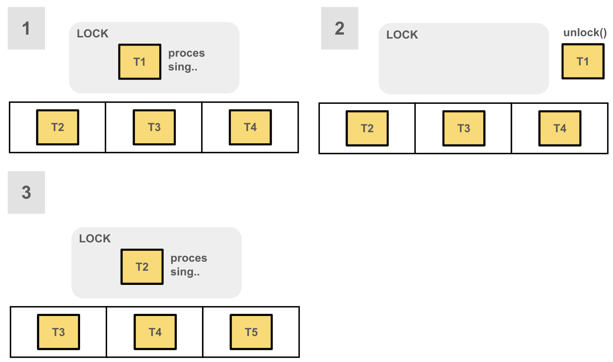

# Lock Fair

## 1. 개요

- ReentrantLock 은 두 종류의 락 공정성 설정을 지원한다.
- 불공정 방법과 공정 방법이며 생성자에서 Boolean 인자로 공정성을 지정하게 된다(디폴트는 불공정)

## 2. 불 공정성

- 불 공정한 락으로 생성된 경우 경쟁 상황에서 읽기 및 쓰기 락에 대한 진입 순서는 정해지지 않으며 하나 이상의 읽기 또는 쓰기 스레드를 무기한으로 연기할 수 있으나 일반적으로 **공정한 락보다 더 높은 처리량을 가진다**
- 불 공정성은 락을 획득하려는 시점에 락이 사용 중이라면 대기열에 들어가게 되고 락이 해제되었다면 대기열에 대기중인 스레드를 건너뛰고 락을 획득하게 되는 정책이다
- 대부분의 경우 공정하게 처리해서 얻는 장점보다 불공정하게 처리해서 얻는 성능상 이점이 더 크다. 
  -  락을 사용하고자 하는 스레드가 있을 때 바로 획득하게 하는 것이 대기 중인 스레드를 찾아 락을 획득하도록 처리하는 시간보다 더 빠르기 때문이다

### 순서도

## 3. 공정성

- 공정한 락으로 생성된 경우 스레드는 도착 순서 정책을 사용하여 진입하는데 현재 보유 중인 락이 해제될 때 가장 오래 기다린 단일 쓰기 스레드가 쓰기 락을 할당받거나 모든 대기하는 쓰기 스레드보다 더 오래 기다린 읽기 스레드 그룹이 있는 경우 해당 그룹이 읽기 락을 할당받게 된다
- 공정한 읽기 락(재진입이 아닌 경우)을 획득하려는 스레드는 쓰기 락이 보유 중이거나 대기 중인 쓰기 스레드가 있는 경우 차단되며 가장 오래 대기 중인 쓰기 스레드가 쓰기 락을 획득하고 해제한 후에 읽기 락을 획득한다 
- 물론 대기 중인 쓰기 스레드가 대기를 포기하고 쓰기 락이 해제되어 읽기 락이 가능한 상태가 되면 해당 읽기 스레드들이 읽기 락을 할당받게 된다
- 공정한 쓰기 락(재진입이 아닌 경우)을 획득하려는 스레드는 읽기 락과 쓰기 락 모두 대기하는 스레드가 없을 경우 락을 획득하고 그 외에는 차단된다
- **공정성 락은 성능은 감수하더라도 기아상태(Starvation) 을 방지해야 하는 상황이 꼭 필요할 경우 좋은 해결책이 될 수 있다**
- ReentrantLock.tryLock() 메서드는 공정성을 따르지 않고 대기 중인 스레드와 관계없이 락을 즉시 획득하며 ReentrantLock.tryLock(timeout, TimeUnit) 은 공정성을 따른다

### 순서도

## 4. 예제

~~~
reentrant/api
_12_ 코드참조
~~~

