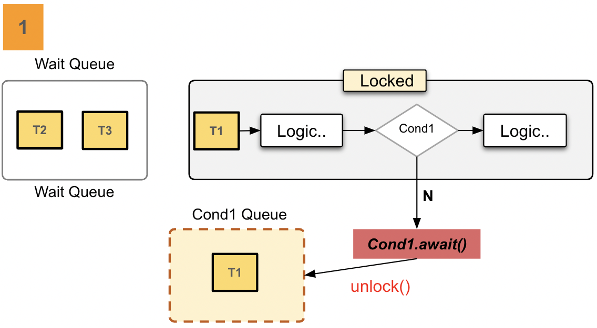
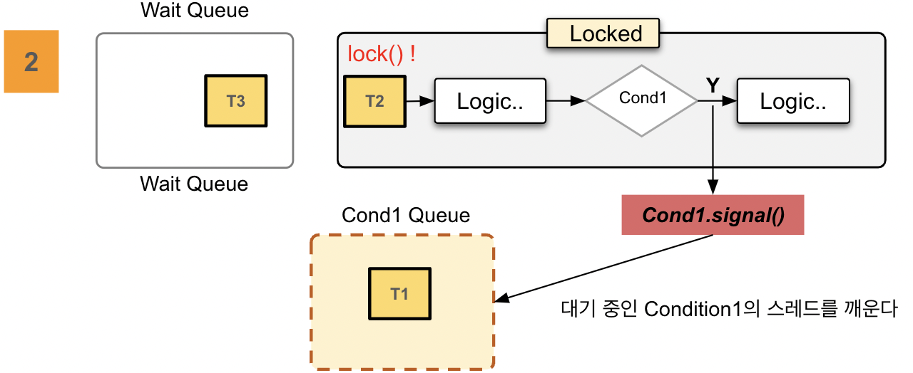
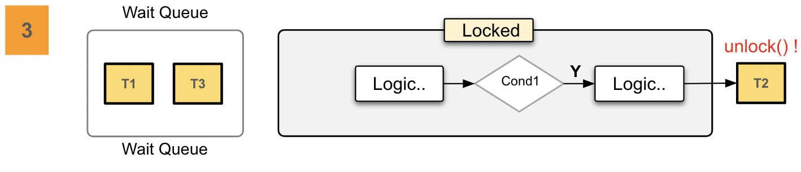
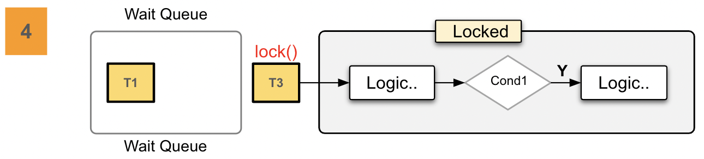
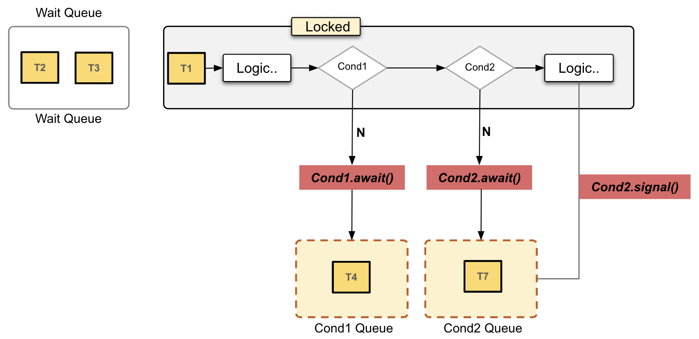

# Condition

## 1. 개요

- Condition 은 조건 변수 또는 조건 큐로 알려진 객체로서 Lock 과 결합하여 객체 당 여러 개의 Wait Queue 을 가지는 효과를 제공한다 
- Lock 이 synchronized 메서드와 문장의 사용을 대체하는 것처럼 Condition은 Object 모니터의 사용을 대체하며 Lock 에 바인딩된다
- Condition 은 한 스레드가 다른 스레드로부터 어떤 상태 조건이 참이 될 수 있다는 통지를 받을 때까지 실행을 중단하도록 하는 수단을 제공한다. 
- Condition 의 가장 중요한 특성은 락을 원자적으로 해제하고 현재 스레드를 중단하는 것이며 이는 Object.wait() 메서드와 동일하게 동작한다

## 2. Diagram

## 3. Condition API

#### void await() throws InterruptedException;

~~~
1. 현재 스레드가 다음 네 가지 중 하나가 발생할 때까지 대기하게 되며 이 Condition 과 관련된 락은 원자적으로 해제된다
  1) 다른 스레드가 이 Condition에 대해 signal 메서드를 호출하고 현재 스레드가 깨어날 스레드로 선택되는 경우
  2) 다른 스레드가 이 Condition에 대해 signalAll 메서드를 호출한 경우 
  3) 다른 스레드가 현재 스레드를 인터럽트하고 스레드 중단의 인터럽션을 지원하는 경우
  4) 의미 없는 깨어남(spurious wakeup) 이 발생한 경우

2. 이 메서드가 반환되기 전에 현재 스레드는 이 Condition 과 관련된 락을 다시 획득해야 한다
3. 메서드 호출 시 스레드가 인터럽트 상태로 설정되어 있거나 또는 대기 중에 인터럽트되는 경우 InterruptedException 이 발생하고 현재 스레드의 인터럽트 상태가 초기화된다
4. 메서드가 호출될 때 현재 스레드는 이 Condition 과 관련된 락을 보유하고 있어야 하며 그렇지 않은경우 IllegalMonitorStateException 예외가 발생한다
~~~

#### void awaitUninterruptibly();

~~~
1. 현재 스레드가 다음 네 가지 중 하나가 발생할 때까지 대기하게 되며 이 Condition과 관련된 락은 원자적으로 해제된다
  1) 다른 스레드가 이 Condition에 대해 signal 메서드를 호출하고 현재 스레드가 깨어날 스레드로 선택되는 경우
  2) 다른 스레드가 이 Condition에 대해 signalAll 메서드를 호출한 경우 
  3) 다른 스레드가 현재 스레드를 인터럽트하고 스레드 중단의 인터럽션을 지원하는 경우
  4) 의미 없는 깨어남(spurious wakeup) 이 발생한 경우

2. 이 메서드가 반환되기 전에 현재 스레드는 이 Condition 과 관련된 락을 다시 획득해야 한다
3. 메서드 호출 시 스레드가 인터럽트 상태로 설정되어 있거나 또는 대기 중에 인터럽트 되더라도 시그널을 받을 때 까지 계속 대기하며 현재 스레드의 인터럽트 상태는 유지된다
4. 메서드가 호출될 때 현재 스레드는 이 Condition 과 관련된 락을 보유하고 있어야 하며 그렇지 않은경우 IllegalMonitorStateException 예외가 발생한다

~~~

#### long awaitNanos(long nanosTimeout) throws InterruptedException;

~~~
1.현재 스레드가 다음 네 가지 중 하나가 발생할 때까지 대기하게 되며 이 Condition과 관련된 락은 원자적으로 해제된다
  1) 다른 스레드가 이 Condition에 대해 signal 메서드를 호출하고 현재 스레드가 깨어날 스레드로 선택되는 경우
  2) 다른 스레드가 이 Condition에 대해 signalAll 메서드를 호출한 경우 
  3) 다른 스레드가 현재 스레드를 인터럽트하고 스레드 중단의 인터럽션을 지원하는 경우
  4) 의미 없는 깨어남(spurious wakeup) 이 발생한 경우

2. 이 메서드가 반환되기 전에 현재 스레드는 이 Condition 과 관련된 락을 다시 획득해야 한다 
3. 이 메서드는 지정된 나노초 값에 대한 남은 나노초의 추정치를 반환하거나 시간이 초과된 경우 0보다 작거나 같은 값을 반환한다 
4. 지정된 나노초 시간이 경과할 때까지 대기하도록 한다
5. 메서드 호출 시 스레드가 인터럽트 상태로 설정되어 있거나 또는 대기 중에 인터럽트되는 경우 InterruptedException이 발생하고 현재 스레드의 인터럽트 상태가 초기화된다
6.메서드가 호출될 때 현재 스레드는 이 Condition 과 관련된 락을 보유하고 있어야 하며 그렇지 않은경우 IllegalMonitorStateException 예외가 발생한다

~~~

#### boolean await(long time, TimeUnit unit) throws InterruptedException;

~~~
1. 현재 스레드가 다음 네 가지 중 하나가 발생할 때까지 대기하게 되며 이 Condition과 관련된 락은 원자적으로 해제된다
  1) 다른 스레드가 이 Condition에 대해 signal 메서드를 호출하고 현재 스레드가 깨어날 스레드로 선택되는 경우
  2) 다른 스레드가 이 Condition에 대해 signalAll 메서드를 호출한 경우 
  3) 다른 스레드가 현재 스레드를 인터럽트하고 스레드 중단의 인터럽션을 지원하는 경우
  4) 의미 없는 깨어남(spurious wakeup) 이 발생한 경우

2. 이 메서드가 반환되기 전에 현재 스레드는 이 Condition 과 관련된 락을 다시 획득해야 한다
3. 지정된 대기 시간이 경과할 때까지 대기하도록 합니다. 이 메서드는 awaitNanos(unit.toNanos(time)) > 0  같은 동작을 한다
4. 메서드 호출 시 스레드가 인터럽트 상태로 설정되어 있거나 또는 대기 중에 인터럽트되는 경우 InterruptedException이 발생하고 현재 스레드의 인터럽트 상태가 초기화된다
5. 메서드가 호출될 때 현재 스레드는 이 Condition 과 관련된 락을 보유하고 있어야 하며 그렇지 않은경우 IllegalMonitorStateException 예외가 발생한다

~~~

#### boolean awaitUntil(Date deadline) throws InterruptedException;

~~~
1.현재 스레드가 다음 네 가지 중 하나가 발생할 때까지 대기하게 되며 이 Condition과 관련된 락은 원자적으로 해제된다
  1) 다른 스레드가 이 Condition에 대해 signal 메서드를 호출하고 현재 스레드가 깨어날 스레드로 선택되는 경우
  2) 다른 스레드가 이 Condition에 대해 signalAll 메서드를 호출한 경우 
  3) 다른 스레드가 현재 스레드를 인터럽트하고 스레드 중단의 인터럽션을 지원하는 경우
  4) 의미 없는 깨어남(spurious wakeup) 이 발생한 경우

2. 모든 경우에 이 메서드가 반환되기 전에 현재 스레드는 이 조건과 관련된 락을 다시 획득해야 하며 스레드가 반환되면 해당 락을 보유하는 것이 보장된다
3. 지정된 마감 시간이 경과할 때까지 대기하도록 합니다. 이 메서드의 반환 값은 마감 시간이 경과했는지 여부를 나타낸다 
4. 메서드 호출 시 인터럽트 상태가 설정되어 있거나 또는 대기 중에 인터럽트되는 경우 InterruptedException이 발생하고 현재 스레드의 인터럽트 상태가 초기화된다
5. 메서드가 호출될 때 현재 스레드는 이 Condition 과 관련된 락을 보유하고 있어야 하며 그렇지 않은경우 IllegalMonitorStateException 예외가 발생한다

~~~

#### void signal();

~~~
1. 대기 중인 스레드 하나를 깨우며 이 Condition 에서 대기 중인 스레드가 있다면 그 중 하나가 깨어난다. 
2. 깨어난 스레드는 await에서 반환되기 전에 다시 락을 획득해야 한다
3. 메서드가 호출될 때 현재 스레드는 이 Condition 과 관련된 락을 보유하고 있어야 하며 그렇지 않은경우 IllegalMonitorStateException 예외가 발생한다
~~~

#### void signalAll();

~~~
1. 모든 대기 중인 스레드를 깨우며 만약 어떤 스레드가 이 Condition 에 대해 대기 중이라면 모든 대기 중인 스레드가 깨어난다 
2. 각 스레드는 await 에서 반환되기 전에 락을 다시 얻어야 한다
3. 메서드가 호출될 때 현재 스레드는 이 Condition 과 관련된 락을 보유하고 있어야 하며 그렇지 않은경우 IllegalMonitorStateException 예외가 발생한다
~~~

## 4. 순서도

- Condition은 여러개를 정의해서 사용할 수 있다.
  - wait set의 구획을 정할 수 있기 때문에, Lock 획득 경합 부담을 줄일 수 있다.

## 5. 예제

~~~
reentrant/api/
_15_, _16_ 코드참조
~~~

