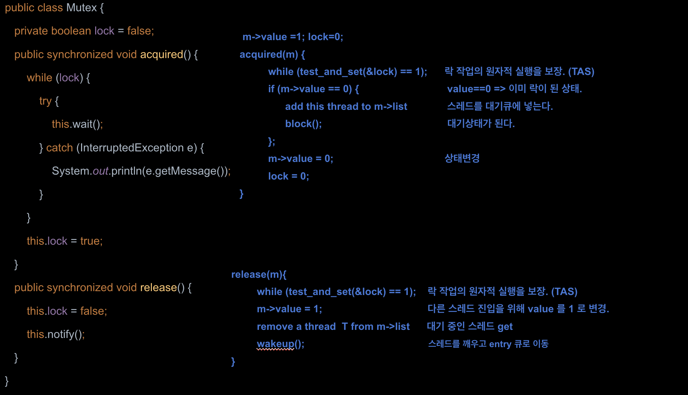

# Mutex

## 개요

- 뮤텍스(Mutual Exclusion) 또는 상호 배제는 공유 자원에 대한 경쟁 상태를 방지하고 동시성 제어를 위한 락 메커니즘이다
- 스레드가 임계영역에서 Mutex 객체의 플래그를 소유하고 있으면(락 획득) 다른 스레드가 액세스할 수 없으며 해당 임계영역에 액세스하려고 시도하는 모든 스레드는 차단되고 Mutex 객체 플래그가 해제된 경우(락 해제)에만 액세스할 수 있다 
- 이 메커니즘은 Mutex 락을 가진 오직 한개의 스레드만이 임계영역에 진입할 수 있으며 락을 획득한 스레드만이 락을 해제 할 수 있다 

## pseudocode

뮤텍스는 락과 락해제를 통해 자원을 보호하는 락체계 동기화 도구이다

~~~java
do { 
      acquired(mutex)                                      
         critical section
     release(mutex)                                                 
        remainder section 
} while (true);
~~~

​	

## 문제점

- **데드락(Deadlock)**
  
  - 잘못된 뮤텍스 사용으로 인해 데드락이 발생할 수 있다.
  
- **오버헤드**
  
  - 뮤텍스를 사용하면 여러 스레드가 경합하면서 락을 얻기 위해 스레드 스케줄링이 발생한다. 이로 인해 오버헤드가 발생하고 성능이 저하될 수 있다
  
- **성능 저하**
  
  - 뮤텍스를 사용하면 락을 얻기 위해 스레드가 대기하게 되고, 스레드의 실행 시간이 블록되면서 성능 저하가 발생할 수 있다
  
  

## 예제

~~~
mutex/
예제참고 ^^
~~~

~~~java
class SharedData {
    private int data = 0;
    private Mutex mutex;
    public SharedData(Mutex mutex) {
        this.mutex = mutex;
    }
    public void sum() {
        mutex.acquired();
        try {
            for (int i = 0; i < 10_000_0000; i++)
                data++;
        } finally {
            mutex.release();
        }
    }
    public int getSum() {
        return data;
    }
}
~~~

