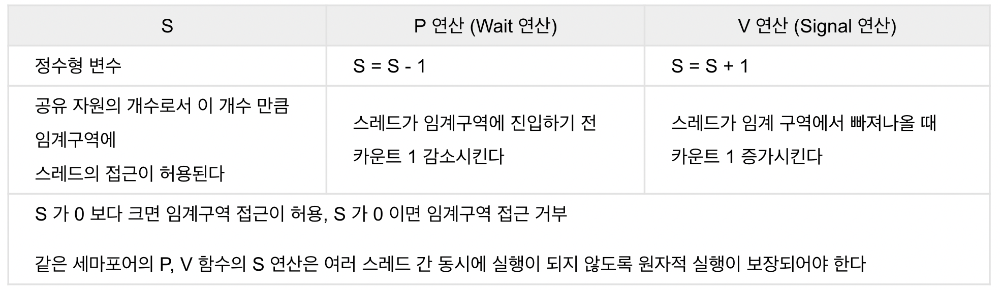
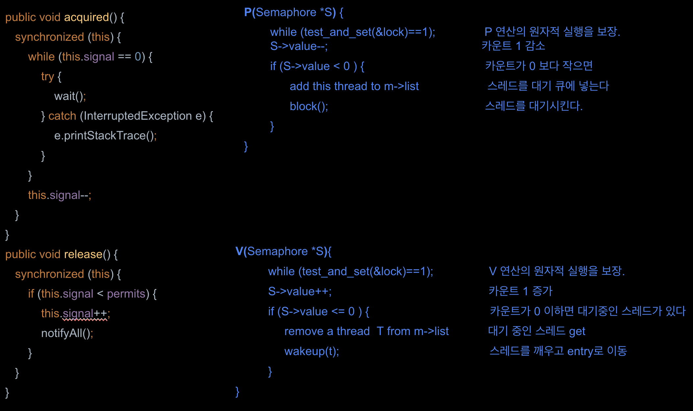
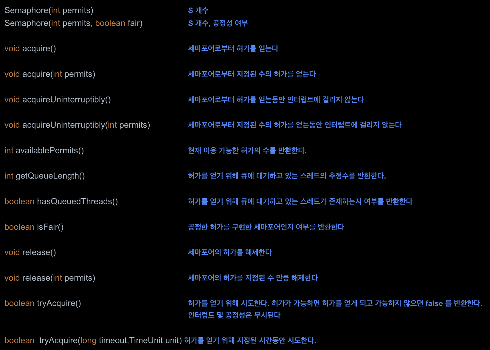

# Semaphore

세마포어는 특정 신호에 의해 공유자원의 접근을 제어하고 보호하는 신호체계 동기화 도구이다

## 개요

- 세마포어는 공유 자원에 대한 접근을 제어하기 위해 사용되는 신호전달 메커니즘 동기화 도구이다
- 세마포어는 정수형 변수 **S** 와 **P**(Proberen: try), **V**(Verhogen: increment)의 두 가지 원자적 함수로 구성된 신호전달 메커니즘 동기화 도구이다
- P 는 임계 영역을 사용하려는 스레드의 진입 여부를 결정하는 연산으로 Wait 연산이라고도 하고 V 는 대기 중인 프로세스를 깨우는 신호(Wake-up)로 Signal 연산이라고 한다
- 스레드가 임계영역에 진입하지 못할 경우 자발적으로 '대기(BLOCK)'상태에 들어가고 임계영역을 빠져나오는 스레드가 대기상태의 스레드를 실행대기상태로 깨워준다
- 자바에서는 java.util.concurrent 패키지에 세마포어 구현체를 포함하고 있기 때문에 직접 세마포어를 구현할 필요는 없다

## pseudocode

~~~java
do { 
P(S); 
	critical section 
V(S);
	remainder section 
} while (true);
~~~

## 예제

~~~
semaphore/
예제참고 ^^
~~~

### 예제1) binary

~~~java
public class _02_BinarySemaphore implements MySemaphore {
    private int signal = 1;

    public synchronized void acquired() {
        while (this.signal == 0) {
            try {
                wait();
            } catch (InterruptedException e) {
                Thread.currentThread().interrupt(); // 현재 스레드의 인터럽트 상태 set
            }
        }
        this.signal = 0;
    }

    public synchronized void release() {
        this.signal = 1;
        this.notify();
    }
}
~~~

### 예제2) counting

~~~java
public class _03_CountingSemaphore implements MySemaphore {
    private int signal;
    private int permits;

    public _03_CountingSemaphore(int permits) {
        this.permits = permits;
        this.signal = permits;
    }

    public void acquired() {
        synchronized (this) {
            while (this.signal == 0) {
                try {
                    wait();
                } catch (InterruptedException e) {
                    e.printStackTrace();
                }
            }
            this.signal--;
        }
        System.out.println(Thread.currentThread().getName() + " 락 획득, 현재 세마포어 값: " + signal);
    }

    public void release() {
        synchronized (this) {
            if (this.signal < permits) {
                this.signal++;
                System.out.println(Thread.currentThread().getName() + " 락 해제, 현재 세마포어 값: " + signal);
                notifyAll();
            }
        }
    }
}
~~~

### 예제3) order

~~~java
class OrderedSemaphore {
    private int signal = 0;  // 순서관리 신호 변수

    public synchronized void acquired(int order) {
        while (this.signal != order) {
            try {
                wait();
            } catch (InterruptedException e) {
                System.out.println(e.getMessage());
            }
        }
    }

    public synchronized void release() {
        this.signal++;
        notifyAll();
    }
}
~~~

~~~java
Thread B = new Thread(() -> {
    semaphore.acquired(1);
    System.out.println("Thread B is running");
    semaphore.release();
});

Thread.sleep(1000);

Thread A = new Thread(() -> {
    semaphore.acquired(0);
    System.out.println("Thread A is running");
    semaphore.release();
});

Thread C = new Thread(() -> {
    semaphore.acquired(2);
    System.out.println("Thread C is running");
    semaphore.release();
});
~~~

## java Semaphore API

### java semaphore 예제

~~~java
import java.util.concurrent.Semaphore;

public class _01_Semaphore_test {
    private static Semaphore semaphore = new Semaphore(3);

    public static void main(String[] args) {
        for (int i = 1; i <= 5; i++) {
            Thread thread = new Thread(new _01_Worker(i, semaphore));
            thread.start();
        }
    }
}
~~~

