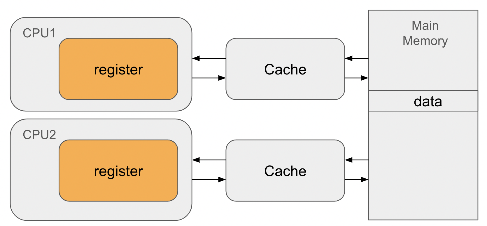
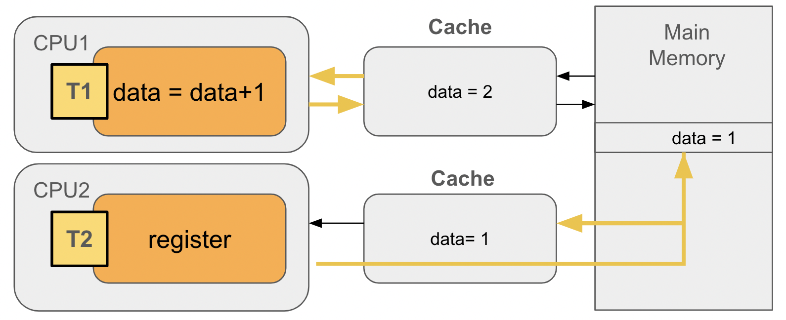
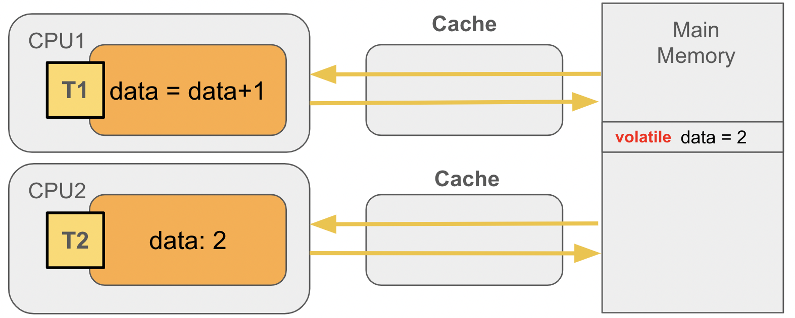
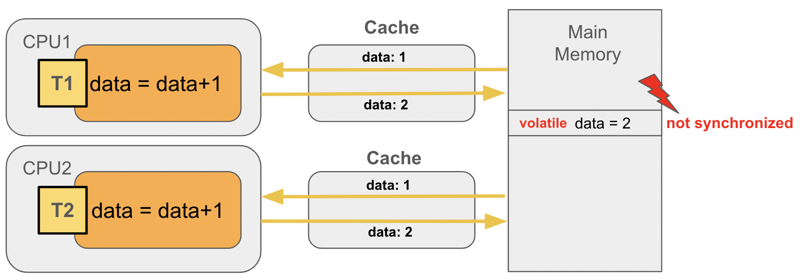
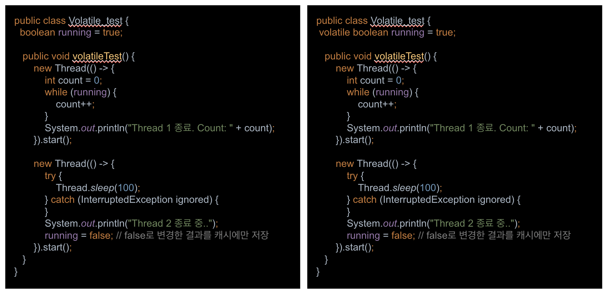

# volatile

## 1. 개요

- volatile 은 변수의 가시성과 연산의 순서를 제어하기 위해 사용하는 키워드로서 스레드 간의 데이터 일관성과 가시성을 보장하는 역할을 한다

### CPU와 Cache

- 대부분 2개 이상의 CPU가 장착되어 있으며 각 코어에는 레지스터와 캐시메모리가 존재한다.
- CPU 캐시 메모리는 CPU 레지스터와 메인 메모리 사이에서 데이터 흐름을 최적화하고 성능을 향상시키기 위해 사용되는 고속 메모리이다
- CPU 는 값을 읽어올 때 우선 캐시에 해당 값이 있는지 확인하고 없는 경우에만 메인 메모리에서 읽어오는 특성을 가진다

## 2. 가시성 문제

### 가시성 ?

- 멀티스레드 환경에서 공유 변수가 한 스레드에서 다른 스레드에게 어떻게 보이는가에 대한 개념
- 멀티스레드 프로그래밍에서는 여러 스레드가 동시에 변수에 액세스하고 수정할 수 있기 때문에 일관된 데이터가 보이도록 가시성을 확보해야 함

### 가시성 문제

- 기존의 멀티코어 구조에서는 가시성문제가 있다.

## 3. volatile

- 캐시 메모리 현상으로 공유 변수에 대해 스레드간 가시성 문제가 발생할 경우 volatile 키워드를 사용하면 가시성 문제를 해결할 수 있다
- 공유 변수에 volatile 키워드를 선언하면 CPU가 데이터 작업을 할 때 메인 메모리에서 공유변수를 직접 읽고 수정된 결과를 메모리에 즉시 반영함으로 가시성 문제를 해결한다

### volatile - 가시성 획득

### volatile - not synchronized

- 여러 스레드가 동시에 공유변수를 수정할 경우 동시성에 문제가 있다.

## 4. 예제

~~~
volatileex/
예제참고 ^^
~~~

