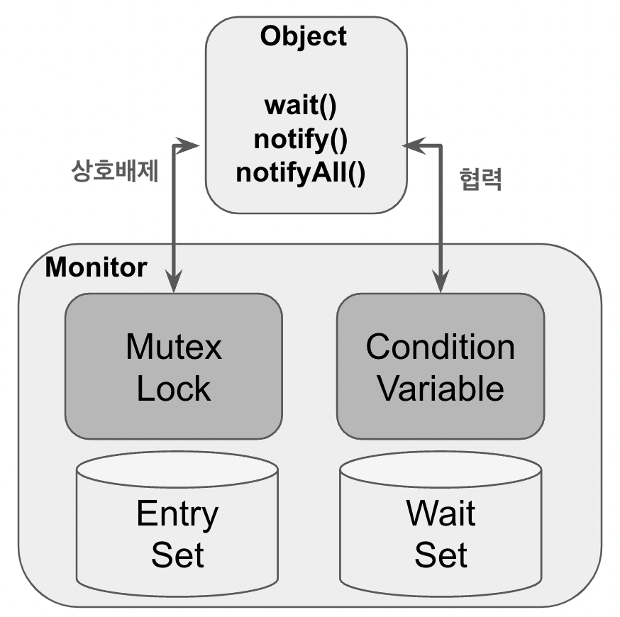
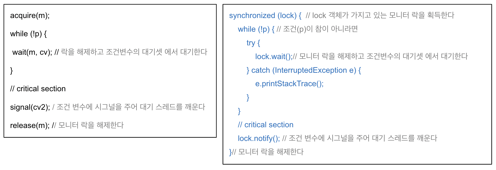

# Monitor

## 1. 개요

- 자바가 동기화를 지원하기 위해 사용하는 메커니즘은 모니터(Monitor) 이며 뮤텍스나 세마포어보다 더 고수준의 동기화 기법이다
- 모든 자바 객체는 기본적으로 모니터를 가지며 여러 스레드가 객체의 임계 영역(critical section)에 진입하려고 할 때 JVM 은 모니터를 사용하여 스레드 간 동기화를 제공한다
- 자바의 모니터는 상호 배제(Mutual Exclusion) 및 협력(Cooperation)이라는 두 가지 동기화 기능을 제공하고 있으며 이를 위해 뮤텍스와 조건변수(Condition Variable)를 사용한다

### 상호배제 (Mutual Exclusion)

- 객체(Class)가 가지고 있는 모니터 Lock 을 통해 여러 스레드가 동시에 공유 자원에 접근하는 것을 막아 데이터의 무결성을 보장하는 메커니즘이다
- JVM 은 `synchronized` 키워드를 이용하여 뮤텍스 동기화를 **암묵적으로** 처리한다.
- synchronized (동기화) => 상호배제
  - synchronized 블록은 해당 객체의 모니터 락을 획득 할 수 있으며 모니터를 획득한 스레드만이 임계영역에 접근 가능하고 그 외 다른 스레드들은 대기 상태가 된다
  - synchronized 블록을 빠져 나오면 모니터 Lock 이 해제되고 대기 중인 다른 스레드 중 하나가 락을 얻고 임계 영역에 진입한다.

### 협력 (Cooperation)

- 협력은 모니터의 Condition Variable (조건 변수) 를 통해 스레드 간 공동의 목표를 위해 상호협력으로 데이터의 일관성과 안전성을 보장하는 동기화 메커니즘이다
- **Condition Variable** (조건변수)
  - 조건변수는 Object 클래스의 메소드인 wait(), notify(), notifyAll()과 함께 작용하면 특정 조건에 따라 스레드를 대기 혹은 깨운다.
  - 스레드가 특정 조건에 부합하지 않을 때 wait() 메소드를 호출하면 조건변수의 Wait Set에 들어가 대기한다
  - 다른 스레드가 특정 조건을 만족해서 notify() 또는 notifyAll() 메소드를 호출하면 Wait Set으로부터 스레드를(들을) 깨워 실행시키게 된다. 
- 조건변수를 통해 스레드 간 대기와 통지를 서로 조절하면서 경쟁 조건(race condition)을 예방한다.
- **모니터 내부에는 여러개의 조건 변수를 가질 수 있지만 자바의 모니터에는 오직 한 개의 조건 변수만 가질 수 있다**.

### Entry Set, Wait Set

- 자바의 모니터 내부에는 EntrySet(진입셋) 과 WaitSet(대기셋) 이라는 자료구조가 있으며 이들은 멀티스레드 환경에서 스레드들 간의 협력을 조정한다.

#### Entry Set

- Entry Set 은 모니터의 Lock 을 획득하기 위해 대기 중인 스레드들을 모아 놓은 자료 구조로서 스레드가 Lock 을 사용 중인 경우 그외 다른 스레드는 Entry Set 에 들어가게 된다 
- Entry Set 에 있는 스레드들은 Lock 이 반납될 때까지 기다리며 락이 반납되면 Entry Set 중 하나의 스레드가 락을 획득하고 임계 영역으로 진입하게 된다 

#### Wait Set

- Wait Set 은 모니터의 조건 변수(Condition variable)와 함께 사용하는 자료구조이며 특정 조건을 만족할 때까지 스레드가 대기하는 곳이다.
- 스레드는 Wait Set 에 들어가가기 전에 Lock 을 해제한다. 이후 다른 스레드에 의해 깨어나게 되면 Entry Set 으로 이동해서 다시 Lock 획득을 위해 경합한다.

## 2. 조건변수 (Condition Variable)

- 조건변수를 통해 상호 협력하고 있는 두 스레드가 wait() 과 notify() 메서드 실행 후에 하나의 모니터를 두고 두 스레드 모두 소유가 가능한 상황이 발생한다
- 하나는 대기중인 스레드, 하나는 깨우는 스레드로서 어떤 스레드가 모니터를 먼저 소유할 것인가에 따라 두 종류의 조건변수로 나눌 수 있는데 Signal and Wait 와 Signal and Continue 이다  .

### signal and wait

- 현재 모니터를 소유하고 있는 스레드가 wait() 을 실행하면 모니터 내부에서 자신을 일시 중단하고 Lock 을 해제한 후 Wait Set 에 들어간다
- 깨우는 스레드가 notify() or notifyAll() 명령을 실행하면 Wait Set 에 있는 대기 스레드 중 하나 또는 모든 스레드를 깨우고 깨우는 스레드는 Lock 을 해제하고 대기한다
- **대기에서 깨어난 스레드가 Lock 을 획득한 후 모든 작업을 마치고 Lock 을 해제하면 깨운 스레드가 Lock 을 획득한 후 계속 작업을 진행한다**
- **대기 스레드와 깨운 스레드 사이에 다른 스레드가 모니터를 소유할 수 없도록 원자적 실행이 보장되어야 한다**

### signal and continue

- 현재 모니터를 소유하고 있는 스레드가 wait() 을 실행하면 모니터 내부에서 자신을 일시 중단하고 Lock 을 해제한 후 Wait Set 에 들어간다
- 깨우는 스레드가 notify() or notifyAll() 명령을 실행하면 Wait Set 에 있는 대기 스레드 중 하나 또는 모든 스레드를 깨운다. 이때 일어난 스레드들은 Entry Set 으로 이동한다
- **깨우는 스레드는 Lock 을 계속 유지하면서 모든 작업을 완료하고 Lock 을 해제**하면 Entry Set 에 대기하고 있는 모든 스레드가 Lock 을 획득하기 위해 경쟁한다
- **자바에서는 이 조건 변수 형식을 취하고있다**

## pseudocode

