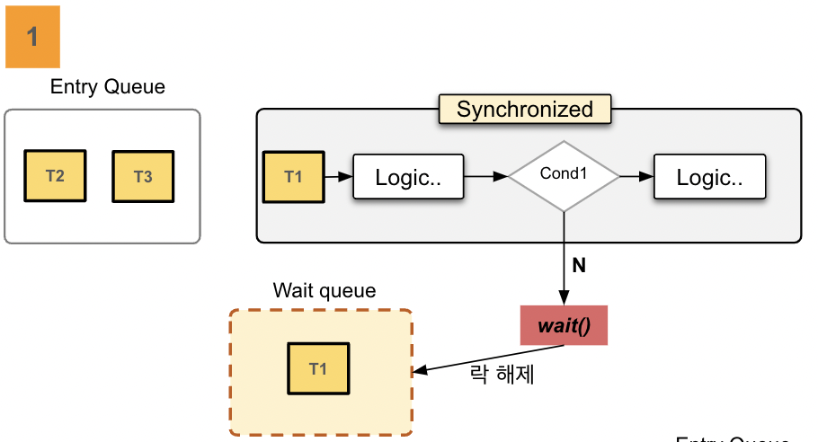
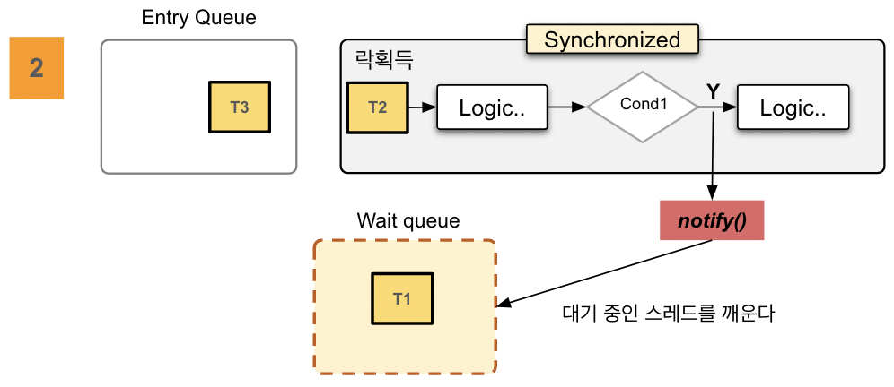
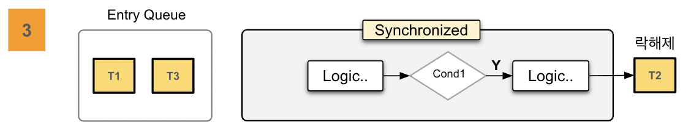
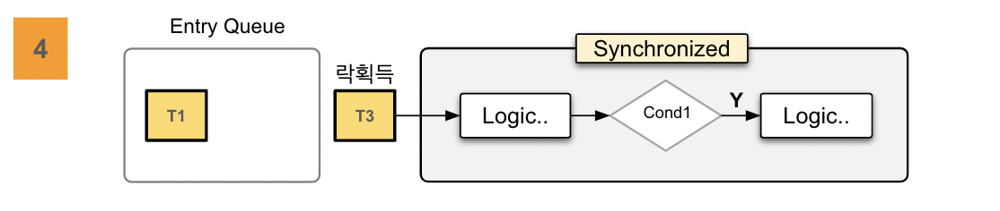
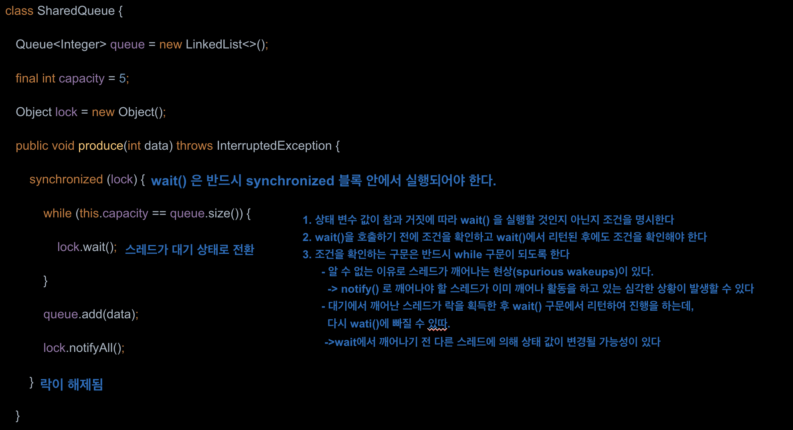

# Synchronized Cooperation

## 1. 개요

### wait(), notify(), notifyAll() 

- 모니터 객체의 조건변수와 함께 사용해서 동기화를 구현할 수 있는 동기화 메커니즘이라 할 수 있다.

- 뮤텍스(상호배제) 동기화 기법으로 충족되지 않는 동기화 문제를 해결할 수 있는 협력에 의한 동기화 장치이다
- 반드시 synchronized 블록 안에서만 사용해야 하며 이는 스레드가 모니터 락을 확보한 상태에서 이 API 들이 작동한다는 것을 의미한다.
  (synchronized 밖에서 사용 시 예외 발생.)

## 2. Object API

### wait()

- 스레드를 대기 상태로 전환시키고 모니터 락은 해제되며 다른 스레드가 모니터 락을 획득하여 작업을 수행할 수 있다
- 조건 변수와 함께 사용되어 특정 조건이 만족될 때까지 대기하게 되며 이를 통해 스레드 간의 효율적인 협력을 구현할 수 있다
- 다른 스레드가 동일한 모니터 락을 획득하고 notify() 또는 notifyAll() 메서드를 호출하면 대기 중의 한 스레드 혹 모든 스레드가 깨어난다
- 스레드는 깨어난 상태에서 바로 실행하는 것이 아니라 락을 획득해야 하며 락을 획득한 스레드는 wait() 다음 구문을 수행하게 된다
- wait(long timeout) 을 사용하여 일정 시간 동안 대기하도록 타임아웃을 지정할 수 있으며 타임아웃이 경과하면 스레드는 자동으로 깨어난다
- 인터럽트가 걸리면 InterruptedException 예외가 발생하고 인터럽트 된 스레드는 대기에서 깨어나게 된다.

### notify() & notifyAll()

- notify()는 같은 모니터의 조건 변수에서 대기 중인 스레드 중에서 임의의 하나를 깨우며 notifyAll()은 스레드 전체를 깨운다. 
- 어떤 스레드가 깨어날 것인지 알 수 없으며 **무작위로 선택**되기 때문에 **notify() 보다 notifyAll() 을 사용하는 것이 안전하다.**
- 깨어난 스레드가 다시 실행되어야 할 때는 해당 객체의 모니터 락을 다시 획득하기 위해 경쟁해야 한다 
- 스레드를 깨울 때 우선순위가 높은 스레드가 깨어날 것이라는 보장은 없다. **운영체제와 JVM의 스케줄링 정책에 따라 결정된다**
- 메서드 호출 후 synchronized 블록이 끝나기 전까지 락이 해제되지 않으며 **해당 블록에서 빠져나가야 락이 해제된다**

## 3. 순서도

## 예제 - 생산자소비자

~~~
monitor/
_10_ 예제참고 ^^
~~~

