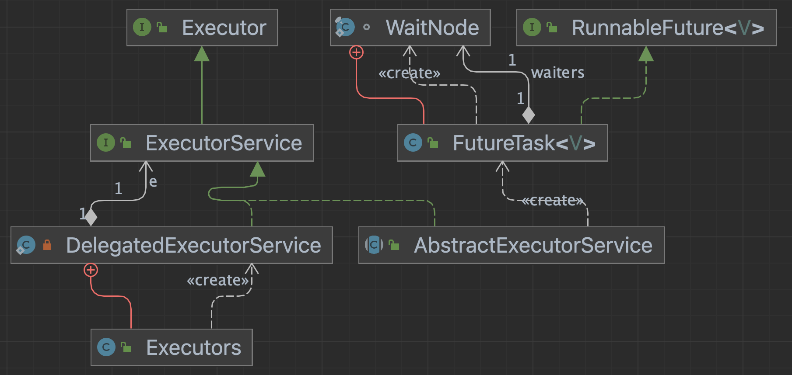

# Future - Task Done

- Future 비동기작업을 디버깅하며 알아보자

~~~java
ExecutorService executorService = Executors.newSingleThreadExecutor();

  Callable<Integer> callableTask = () -> {
      System.out.println("비동기 작업 시작...");
      try {
          Thread.sleep(1000);
      } catch (InterruptedException e) {
          e.printStackTrace();
      }
      System.out.println("비동기 작업 완료.");
      return 100;
  };
  Future<Integer> future = executorService.submit(callableTask);
  try {
      Integer result = future.get();
      System.out.println("Result: " + result);

  } catch (Exception e) {
      e.printStackTrace();
  }

  executorService.shutdown();
~~~

- 클래스 다이어그램




## FutureTask

- state는 아래 7개로 구분된다.

~~~java
    private volatile int state;
    private static final int NEW          = 0;
    private static final int COMPLETING   = 1;
    private static final int NORMAL       = 2;
    private static final int EXCEPTIONAL  = 3;
    private static final int CANCELLED    = 4;
    private static final int INTERRUPTING = 5;
    private static final int INTERRUPTED  = 6;
~~~

- 주요필드 4개

~~~java
// 인자로 받게되는 실제 작업
private Callable<V> callable;
// 작업 완료 후 리턴되는 값
private Object outcome; // non-volatile, protected by state reads/writes
// 
private volatile Thread runner;
// 
private volatile WaitNode waiters;
~~~


### 인스턴스 생성

- Executers 의 inner class 인 DelegatedExecutorService 에 서 실행
- ExecutorService 의 구현체인 AbstractExecutorService 의 submit()가 호출된다.
- FutureTask 에 Callable 를 인자로 한 인스턴스를 생성한다.

~~~java
Future<Integer> future = executorService.submit(callableTask);
~~~


~~~java
public FutureTask(Callable<V> callable) {
    if (callable == null)
        throw new NullPointerException();
    this.callable = callable;
    this.state = NEW;       // ensure visibility of callable
}
~~~


### AbstractExecutorService - submit()

- ThreadPool 로직에 의해 스레드 실행

~~~java
public <T> Future<T> submit(Callable<T> task) {
    if (task == null) throw new NullPointerException();
    RunnableFuture<T> ftask = newTaskFor(task);
    execute(ftask);
    return ftask;
}
~~~

- 위의 newTaskFor 리턴 타입은 아래와 같이 Runnable와 Future를 상속받은 타입이며, 
- FutureTask가 확장한 타입이기도 하다.

```java
public interface RunnableFuture<V> extends Runnable, Future<V> {
    /**
     * Sets this Future to the result of its computation
     * unless it has been cancelled.
     */
    void run();
}
```


### ThreadPoolExecutor - addWorker

- Threadpool 에서 새로운 작업큐를 생성하고, 스레드를 실행한다.
- 이 스레드는 FutureTask 에서 구현한 run() 을호출한다.

~~~java
private boolean addWorker(Runnable firstTask, boolean core) {
 try {
            w = new Worker(firstTask);
            final Thread t = w.thread;
            if (t != null) {
                final ReentrantLock mainLock = this.mainLock;
                mainLock.lock();
                try {
                  ...
                } finally {
                    mainLock.unlock();
                }
                if (workerAdded) {
                    t.start();
                    workerStarted = true;
                }
            }
        } finally {
            if (! workerStarted)
                addWorkerFailed(w);
        }
        ...
~~~


### FutureTask - run()

- ThreadPoolExecutor 에서 실행된 스레드는 아래의 run()을 호출한다.
- 최초에 인자로받았던 Callable타입에서 call()을 실행한다.

~~~java
public void run() {
    if (state != NEW ||
        !RUNNER.compareAndSet(this, null, Thread.currentThread()))
        return;
    try {
        Callable<V> c = callable;
        if (c != null && state == NEW) {
            V result;
            boolean ran;
            try {
                result = c.call();
                ran = true;
            } catch (Throwable ex) {
                result = null;
                ran = false;
                setException(ex);
            }
            if (ran)
                set(result);
        }
    } finally {
        // runner must be non-null until state is settled to
        // prevent concurrent calls to run()
        runner = null;
        // state must be re-read after nulling runner to prevent
        // leaked interrupts
        int s = state;
        if (s >= INTERRUPTING)
            handlePossibleCancellationInterrupt(s);
    }
}
~~~

- 작업 종료 후, outcome에 결과를 받고 
- 상태를 NORMAL 로 변경 후 finishCompletion() 를 실행한다.

~~~java
protected void set(V v) {
    if (STATE.compareAndSet(this, NEW, COMPLETING)) {
        outcome = v;
        STATE.setRelease(this, NORMAL); // final state
        finishCompletion();
    }
}
~~~

- 작업했던 스레드를 해제하고
- LockSupport.unpark(t) 으로 메인스레드를 notify 한다.

~~~java
private void finishCompletion() {
    // assert state > COMPLETING;
    for (WaitNode q; (q = waiters) != null;) {
        if (WAITERS.weakCompareAndSet(this, q, null)) {
            for (;;) {
                Thread t = q.thread;
                if (t != null) {
                    q.thread = null;
                    LockSupport.unpark(t);
                }
                WaitNode next = q.next;
                if (next == null)
                    break;
                q.next = null; // unlink to help gc
                q = next;
            }
            break;
        }
    }

    done();

    callable = null;        // to reduce footprint
}
~~~


### FutureTask - get() 

- state는 NEW 이므로 awaitDone() 실행
- awaitDone() 에서 wait을 수행하고, notify가 될 때까지 메인스레드는 대기하게 된다. (블락킹)

~~~java
// FutureTask.java
public V get() throws InterruptedException, ExecutionException {
    int s = state;
    if (s <= COMPLETING)
        s = awaitDone(false, 0L);
    return report(s);
}
~~~

### FutureTask - awaitDone()

- 반복문을 돌면서 complete, Interrupt , timeout 등 return 할 조건을 검사한다.
- 현재 wait 중인 thread를 큐에서 가져와 할당해준다.
- 모든 조건에 부합하지 않으면 LockSupport.park(this); 로 메인스레드는 wait에 빠진다.

~~~java
private int awaitDone(boolean timed, long nanos)
    throws InterruptedException {
    // The code below is very delicate, to achieve these goals:
    // - call nanoTime exactly once for each call to park
    // - if nanos <= 0L, return promptly without allocation or nanoTime
    // - if nanos == Long.MIN_VALUE, don't underflow
    // - if nanos == Long.MAX_VALUE, and nanoTime is non-monotonic
    //   and we suffer a spurious wakeup, we will do no worse than
    //   to park-spin for a while
    long startTime = 0L;    // Special value 0L means not yet parked
    WaitNode q = null;
    boolean queued = false;
    for (;;) {
        int s = state;
        if (s > COMPLETING) {
            if (q != null)
                q.thread = null;
            return s;
        }
        else if (s == COMPLETING)
            // We may have already promised (via isDone) that we are done
            // so never return empty-handed or throw InterruptedException
            Thread.yield();
        else if (Thread.interrupted()) {
            removeWaiter(q);
            throw new InterruptedException();
        }
        else if (q == null) {
            if (timed && nanos <= 0L)
                return s;
            q = new WaitNode();
        }
        else if (!queued)
            queued = WAITERS.weakCompareAndSet(this, q.next = waiters, q);
        else if (timed) {
            final long parkNanos;
            if (startTime == 0L) { // first time
                startTime = System.nanoTime();
                if (startTime == 0L)
                    startTime = 1L;
                parkNanos = nanos;
            } else {
                long elapsed = System.nanoTime() - startTime;
                if (elapsed >= nanos) {
                    removeWaiter(q);
                    return state;
                }
                parkNanos = nanos - elapsed;
            }
            // nanoTime may be slow; recheck before parking
            if (state < COMPLETING)
                LockSupport.parkNanos(this, parkNanos);
        }
        else
            LockSupport.park(this);
    }
}
~~~

- 락이 해제되면, get() 에서 report() 가호출되어 결과값을 리턴한다.

~~~java
private V report(int s) throws ExecutionException {
    Object x = outcome;
    if (s == NORMAL)
        return (V)x;
    if (s >= CANCELLED)
        throw new CancellationException();
    throw new ExecutionException((Throwable)x);
}
~~~


