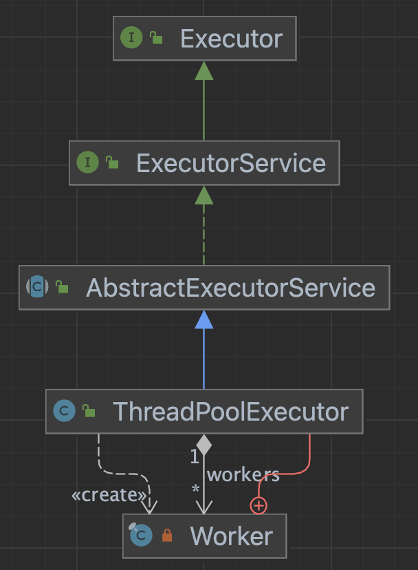
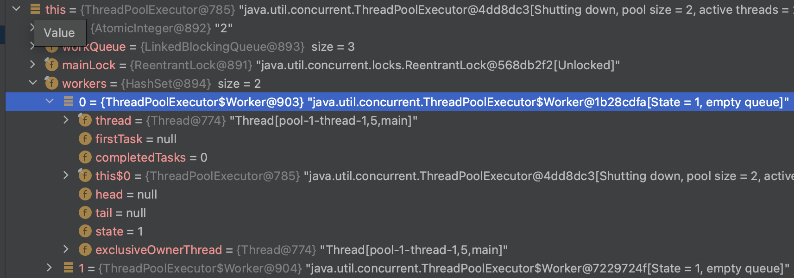

# ExecutorService - shutdownNow





### shutdownNow 분석

- 아래 예제 수행시 api 동작을 알아보자

~~~java
if(!executorService.awaitTermination(2, TimeUnit.SECONDS)){
    executorService.shutdownNow();
    System.out.println("스레드 풀 강제 종료 수행");
}
~~~


### ThreadPoolExecutor

- interruptWorkers() 에서 인터럽트 작업을 수행한다.

```java
public List<Runnable> shutdownNow() {
    List<Runnable> tasks;
    final ReentrantLock mainLock = this.mainLock;
    mainLock.lock();
    try {
        checkShutdownAccess();
        advanceRunState(STOP);
        interruptWorkers();
        tasks = drainQueue();
    } finally {
        mainLock.unlock();
    }
    tryTerminate();
    return tasks;
}
```

- 현재 작업리스트에 있는 workers를 순회하며 interruptIfStarted() 호출

```java
private void interruptWorkers() {
    // assert mainLock.isHeldByCurrentThread();
    for (Worker w : workers)
        w.interruptIfStarted();
}
```




### ThreadPoolExecutor > Worker

- 작업중인 스레드에 인터럽트한다.

~~~java
void interruptIfStarted() {
    Thread t;
    if (getState() >= 0 && (t = thread) != null && !t.isInterrupted()) {
        try {
            t.interrupt();
        } catch (SecurityException ignore) {
        }
    }
}
~~~


### 스레드1

- 아래처럼 InterruptedException 구문이 있다면 즉시 중단할 수 있다.

~~~java
try {
    Thread.sleep(10000);
    System.out.println(Thread.currentThread().getName() + ": 작업 종료");
} catch (InterruptedException e) {
    System.out.println("interrupted!!!");
    Thread.currentThread().interrupt();
    throw new RuntimeException();
}
~~~


### 스레드2

- 반면 아래로직은 모두 수행될 때까지 기다려야 한다.

~~~java
Integer a=0;
for (int j=0 ;j<1_000_000_000 ; j++) {
    a += 1;
}
System.out.println("완료");
return 100;
~~~
